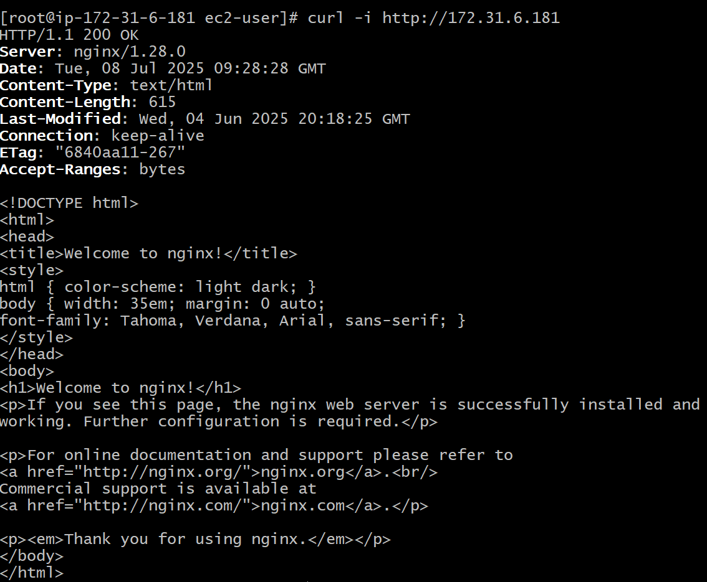
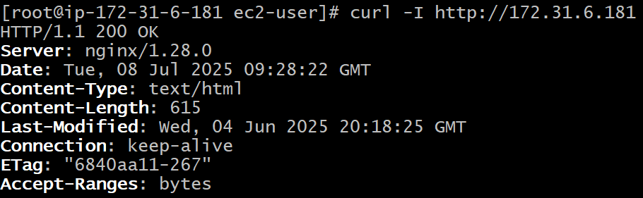

```
curl -i
```
- It shows **response header and body**.
- `-i` means: Include the HTTP **response headers** in the output.
- Test web endpoints, APIs and service availability from command line.



---

```
curl -I
```
- It shows only **response header**.
- It uses **HTTP HEAD** request instead of **GET**.
- `-I` means: Fetch the **headers** only.



---

- If you have and existing folder in Github how you can push code to Github
```
git init
git remote add origin url
```
---

### **How DNS works??**

```
First, we purchase a domain from Hostinger. After completing the payment, we want to host the domain on AWS.
To host it on AWS, we use Route 53. We create a Public Hosted Zone in Route 53 with the same domain name.
This automatically creates NS and SOA records.
We copy the Name Servers (NS) and update them in Hostinger's domain settings to point to AWS.
Then we create an A record in Route 53 to map the domain to the IP address of our server (EC2, ELB, etc).
```

- **Purchase Domain:**
  You purchase a domain (e.g., example.com) from a domain registrar like Hostinger.

- **Create Public Hosted Zone in Route 53:**
  In AWS Route 53, create a Public Hosted Zone using the exact same domain name (e.g., example.com).

- **Update Name Servers in Hostinger:**
  When you create the hosted zone, AWS Route 53 automatically creates NS (Name Server) and SOA records.
  Copy the NS record values (the AWS nameservers like ns-123.awsdns-45.com) and go to Hostinger → domain management → replace Hostinger nameservers with AWS Route 53 nameservers.

- **Create A Record in Route 53:**
  In the hosted zone, create an A record (e.g., for example.com or www.example.com) pointing to your server's public IP or Load Balancer DNS, depending on what you're hosting.

```
https://joindevops.medium.com/how-dns-work-30ef4ba6762c
```
---

### **Linux Commands**
1. tail -f
```
tail -f /var/log/nginx/error.log
```
Monitor logs in real time, useful for debugging issues.

---

2. grep
```
grep -i "error" /var/log/nginx/error.log
```
Search through files, logs and command for specific patterns.
grep `-i`: case-insensitive
grep `-I`: skips binary files while searching

---

3. systemctl
```
systemctl status nginx
```
Control system services - start, stop, restart, status

---

4. journalctl
```
journalctl -u user.service -n 50
```
View logs for systemd-managed services, handy for debugging issues.

---

5. ps aux | grep
```
ps aux | grep nginx
```
To list running processes, I use to find rogue and resource intensive processes. </br>
🧱 **Breakdown**
- `ps`: displays current active processes
- `a`: shows processes for all users
- `u`: display user/owner of the process
- `x`: shows all processes, even those which are running in background not attached to any terminal
- `grep` nginx: filter output to show lines containing nginx

---

6. df -h / du -sh
```
df -h          # Check available disk space
du -sh         # Check folder sizes in current directory
```
Essential for disk space monitoring and clearning large files or folders.

---

7. chmod / chown
```
chmod +x file.sh
chown user:group file.sh
```
Manages file permissions and ownership

---

8. find path -name ".log" -mtime +7
```
find /var/log -name ".log" -mtime +7
```
Locate files based on name, date, type.

---

🧱 **Breakdown**
- `find`: command to search files and directories
- `/var/log`: search path
- `-name ".log"`: search for files ending with .log
- `-mtime +7`: modified time is more than 7 days ago

---

9. rsync
```
rsync -avz /app/ user@server:/backup/
```
Efficient file syncing and backup, much faster and more reliable than scp for large directories. </br>

🧱 **Breakdown**
- `rsync`: Tool to sync files and directories
- `-a`: archive mode(preserves permissions, timestamps and symbolic links)
- `-v`: verbose(show what's happening)
- `-z`: compress data during transfer for faster transmission
- `/app/`: source directory(copy content only not folder)
- `user@server:/backup/`: remote destination

---

### SSH Authentication to Github server
1. import public key in github server
2. create a file called config in .ssh folder inside user directory

- follow the below syntax

```
Host github.com
  HostName github.com
  User git
  IdentityFile ~/.ssh/devops.pem
```